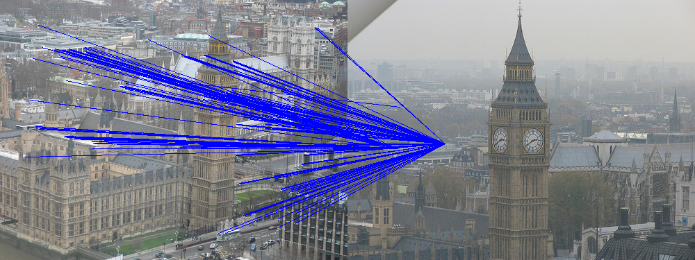

# Assignment #2 Report
Group Members: Seth Mize, Lucas Franz, Bryant Cornwell

## Abstract

## Introduction

Utilizing OpenCV's ORB detection, we matched feature points between two images given a threshold to determine good matches. Paired images that matched well were grouped using an agglomerative clustering algorithm from the sklearn.cluster library and graded based on the pairwise clustering accuracy. 
In part 2 we are given two images of the same object with the objective of applying a transformation using a 3x3 matrix to one of the images to mirror the target image. To accomplish this we are given the necessary number of matching coordinate points in the image to solve for the transformation and then use inverse warping and bilinear interpolation to recreate the desired perspective. 
Combine the feature point matching along with RANSAC and image transformations to blend two images together within the first image's coordinate system. 

## Methods
### part1.py
The first task of part1.py was to develop a function that could apply ORB detection on two images and matches the ORB descriptors between each image using a ratio of the distances between the nearest and second nearest match given a threshold. 

    ./a2 part1 <k> images/*.png outputfile_txt

### part2.py
    ./a2 part2 n img_1.png img_2.png img_output.png img1_x1,img1_y1 img2_x1,img2_x1 ... img1_xn,img1_yn img2_xn,img2_yn
### part3.py
    ./a2 part3 image_1.jpg image_2.jpg output.jpg
## Results

## Discussion
### part1.py
There were some difficulties with that were encountered in the early stages of the orb matching algorithm. The first version of the algorithm was written based on the information gather from the image and feature matching video in Module 6 Feature Points. The initial debugging consistent of changing the keypoint data type in order to carry out mathematical operations. The first visualization of the feature point matching algorithm in the figure below gave an idea of apparent semantic issues. Utilizing a high threshold, many of the orbs from the first image were mapped to similar location(s). The root causes were that the second nearest matches were not updated correctly, and the keypoints were used as the descriptors in the distance calculations.

__ADD MORE IMAGES/ PART1 DISCUSSION POINTS__

The runtime of part1.py using the orb matching algorithm took around 3 hours to run with multiprocessing enabled. While looking through the Q&A board, the class was given permission to use the cv2.BFMatcher().knnMatch() function from the openCV library. This decreased the computational runtime to around 3 minutes.

(Why did we use agglomerative clustering instead of other algorithms? Maybe explain with possible reference?)

Overall, part1.py could be further improved by hyperparameter tuning the clustering algorithm and feature matching threshold. Future improvements to the original feature matching algorithm could provide promising results, but could result in a long development due to the current computational runtime.

### part2.py
Difficulties:
- Solving the system of equations of the projective transform matrix
### part3.py

## Conclusions

## Acknowledges
### Bryant Cornwell 
Co-wrote and tested part1.py with Seth. Contributed to discussions on part2.py. 
For the report, Discussion, Methods -> Part1 and general layout of report.
### Seth Mize
### Lucas Franz

## References
- Module 6.7 video: https://iu.instructure.com/courses/2032639/pages/6-dot-7-image-and-feature-matching?module_item_id=25895156
- Theory on opencv Matcher: https://docs.opencv.org/3.4/dc/dc3/tutorial_py_matcher.html
- 2D Projective Geometry reference: https://fzheng.me/2016/01/14/proj-transformation/